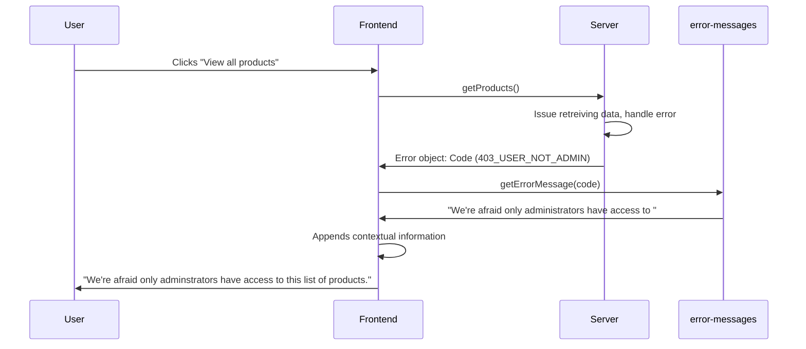

# Sane Error Messages

Gone are the days of useless generic error messaging. Keep your end-users happy with `sane-error-messages`.

## Todo

- [ ] Script can be run via `npx` 
- [x] Get a repo set up 
- [x] Run a script that generates a new project for someone
- [x] Add instructions into a README
- [x] Use `tsdx` to handle all package management

Nice to have

- [ ] Link to error code object from remote
  - Would this be done at build time or run time?
- [ ] Clean up the exports, and reduce code repetition
- [ ] Create a javascript version

## The current state of error messaging

In a perfect would, this package would be completely redundant, but your end users are going to come across errors. These errors can stem take the form as:

- Validation errors
- Server-side failures
- Rate limiting
- Broken code
- Acts of god

Quite often, client-facing error messaging take shape in one of two ways:

- Generic errors with no meaningful information, e.g. `Something went wrong, please try again later`
- Hyper specific messages from the stack trace sent by the server, e.g. `Error 10x29183: line 26: error mapping Object -> Int32` 

Neither are helpful for our end users.

The first creates a feeling of helplessness and frustration. A user is prevented from completing an action, and have no way to know why it happened, and how (or if) they can avoid it. This can result in loss of end-user trust, or loss of customer.

The latter error messages are a leaky abstraction that shouldn't be making their way over to the end user's eyes. As well as providing implementation information about servers... what's kinneret's rationale?

## Why should we create sane error messaging?

**Developer Sanity**

Hunting bugs is hard, and scanning logs is tedious. If an end-user reports a bug it's important that they are able to present to us as much useful information as possible.

A report from a user that says:

`Hi, I was using the app sometime last night updating my profile and all of a sudden it stopped working. The error said something about an internal server error, but I don't know what that means`

is much less useful than:

`Hi, I was using the app sometime last night updating my profile and all of a sudden it stopped working. The error said "We had trouble updating your details. Your address must be located within the EU`

This potentially saves us time and cuts down on possible red herrings. It's also possible that a specific error message might help an end-user understand what they themselves have done wrong, and will help them rectify their mistake.

**End-user Sanity**

If you're here, it's likely you're concerned with making your user-facing products as delightful as possible. Error messaging plays an important role in that. Having useful error messages can go a long way to making a frustrating scenario for an end-user, as pleasant as possible.

**What makes a good error message?**

Taken from Microcopy: A complete guide. A useful error message should satisy these qualities:

- Explain clearly that there is a problem
- Explain what the problem is
- If possible, provide a solution so that the user can complete the process, or
- Point them to where they can go for help
- Make a frustrating scenario as pleasant as possible

## Getting started

### Setting up your error messages

Begin by running

`yarn global add sane-error-message` and
`sane-error-messages create <dirName>` to scaffold your project. Doing so will create a brand new module for you to customise with your default error messages. Your new module uses `tsdx` under-the-hood to handle all of the module management scripts, such as running, building, testing. 

You can learn more about [tsdx here](https://tsdx.io/)

Your project's default api will look like this:

```typescript
/* Define each code like so */
const USER_NOT_ADMIN = '403_USER_NOT_ADMIN'

/* Map each code to a default message */
private const errorCodes {
  // your codes and messages go here...
  '[USER_NOT_ADMIN]': "We're afraid only administrators have access to "
}

//The class used to initialise the error messages object in your project
class ErrorMessages {
  // You can override default messages with more specific ones
  constructor: (customErrorMessages: Partial<Record<ErrorCode, string>>): ErrorMessages;

  // Pass through an error code to get your custom message
  getErrorMessage: (code: string | number, fallbackMessage?: string): string;

	// Returns the errorCodes object with your custom messages
  messages: Record<ErrorCode, string>
}
  
function isErrorCode(code: string | number): boolean;

type ErrorCode = ValueOf<errorCodes>

```


### Consuming your error messages

```typescript
import { ErrorMessages } from 'custom-error-messages';

const customErrorMessages = {
  '400_validation': 'Please enter the fields in your form correctly',
};

// Initialise your errorMessages object with your custom messages
const errorMessages = new ErrorMessages(customErrorMessages);

// When this runs, the server will return an error
// When we catch this error, we get our message via the error code
// The message is then displayed on the clientside
function riskyFunction() {
  try {
    await boom();
  } catch (err) {
    const { code } = err;
    const message = errorMessages.getErrorMessage(code);
    displayNotification(message);
  }
}

```

## Scenario

Parts Unlimited have released an update to their core API. It allows those with a role of `admin` to list all product information, but those with a role of `user` do not have permission.

The frontend shows the 'View all products' button regardless of role.




## FAQs

**Why can't the server-side just return these messages?**

The server shouldn't be concerned with any client-facing logic, but if you're fortunate enough to work with an API that gives useful error codes with each failed request, then you're nearly there.

**Will I need to create an instance of error-messages for every API consumer?**

No necessarily. Because this package can take a list of default messages and codes, as long as it's in sync with the APIs, your frontends will be able to consume the same package. In each client-side instance, you can pass through additional error codes, or override existing messages to tailor your frontend messaging.

**I think this package should have X or do Y differently**

I'm dogfooding this internally at my job, and this is a problem space I'm very new to. I would love to hear of any suggestions, or improvements to the overall architecture or feature-set of `sane-error-messages`.